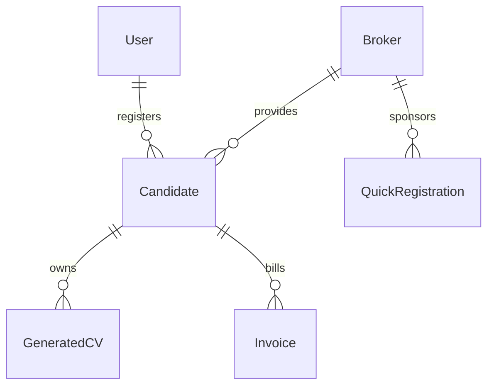

# Technical & Functional Overview: DAERA Agency Portal
### A High-Performance Management Ecosystem for Recruiting and Manpower Deployment

---

### 1. Introduction & Core Objective

**DAERA** (also known as Coolstaff) is a robust, full-stack enterprise web application designed to digitize and automate candidate sourcing, compliance vetting (medical/biometrics), client portfolio dispatch, and invoicing for international recruitment agencies. 

By replacing unstructured spreadsheets and manual processes with a central, automated database, the platform guarantees data integrity, speeds up candidate processing times, and automates document-heavy tasks such as CV formatting and client invoicing.

---

### 2. Technological Stack

The system is built on a split architecture consisting of a high-performance frontend client and a dedicated backend microservice api:

* **Frontend Client (Next.js 15 & React 19):** Built with TypeScript, Next.js App Router (`src/app`), and Tailwind CSS v4. Lucide React provides modern UI iconography. Client-side utilities like `Tesseract.js` perform instant OCR.
* **Backend Server (Node.js & Express):** A TypeScript-powered REST API (`src/routes`, `src/index.ts`) running on Express. Utilizes `tsx` for developer-friendly typescript execution.
* **Database & ORM (MySQL & Prisma):** Powered by a relational MySQL database managed via Prisma ORM. Prisma handles schema migrations, relational indexing, and safe query execution.
* **Authentication (Better Auth):** Implements `better-auth` for robust session-based identity verification, handling user roles (`super_admin`, `admin`, `agency`, `user`), password hashing, and cookie-based auth tokens.
* **Cloud Storage (Cloudinary & Local Storage):** Integrates Cloudinary API for secure hosting of candidate images (passports, headshots, full-body images) and PDF documents.

---

### 3. Core Database Models & Schema Relationships

The system database (`schema.prisma`) is organized around five major relational pillars:



1. **User:** Internal team members (Super Admins, Admins, Staff) who register candidates and control settings. Managed securely via Better Auth.
2. **Broker:** Agency partners and sub-agents who submit candidate pipelines. The broker model ensures every candidate is credited to their sourcing agent.
3. **Candidate:** The central entity storing comprehensive details:
   * **Travel Credentials:** Passport number, dates of issue/expiry, nationality, issuing country.
   * **Vetting Progress:** Trackers for Medical Status (`Pending`, `Fit`, `Unfit`) and Biometrics.
   * **Skill Sets:** Job role, language levels, work history JSON arrays, education level.
   * **Asset Storage:** Cloud links for passport scans, candidate face photos, and emergency contact details.
4. **QuickRegistration:** A lightweight database for fast walk-in queues (e.g. Musaned intake). Collects basic passport OCR info, religion, and contact details prior to detailed profiling.
5. **GeneratedCV:** Records generated CV templates (`alm`, `ka7`, `ku2`, `ma`, `ra`) mapped to candidates.
6. **Invoice:** Connects a candidate to their billing cycle. Stores financial information along with tracking URLs for LMIS QR codes, ticket stubs, and insurance certificates.

---

### 4. Advanced Under-the-Hood Technologies

The app integrates multiple smart libraries to automate standard recruiting overhead:

* **Passport OCR & MRZ Processing:** Using client-side `Tesseract.js` and server-side `mrz` (Machine Readable Zone) library. The app scans candidate passports, extracts crucial dates (DOB, expiry), name, and travel data automatically, eliminating keyboard entry.
* **Word (.docx) and PDF Document Automation:** Utilizes `docxtemplater`, `docx`, and `html-to-docx` to load official corporate word templates, inject candidate information dynamically, and output formatted print/download-ready files. Client PDF downloads are managed via `jspdf` and `html2pdf.js`.
* **Gemini Generative AI Integration:** Powered by `@google/generative-ai` to offer intelligent candidate profiling and automated data formatting.
* **Automated QR Generation:** Generates scan-ready QR codes dynamically via `qrcode` package for invoice verification.

---

### 5. Step-by-Step System Workflow

```
[Candidate Sourced] 
       │
       ▼
[Intake Form / Passport Upload] ────► Client OCR / Server MRZ parses passport details
       │
       ▼
[Database Record Created] ──────────► Relates Candidate to User (recruiter) & Broker (agent)
       │
       ▼
[Compliance Phase] ─────────────────► Staff logs Medical and Biometric clearances
       │
       ▼
[CV Export] ────────────────────────► Server-side CV Generator compiles Word/PDF resumes
       │
       ▼
[Placement & Billing] ──────────────► Candidate assigned to a visa; Invoice generated automatically
```

1. **Data Intake:** Candidate files are uploaded by staff or brokers. The system uses OCR to parse passport data immediately to reduce typing.
2. **Profile Completion:** Recruiter appends work experience, language options, and photo uploads.
3. **Compliance Vetting:** Medical and Biometric status changes are recorded. If marked as `Unfit`, the system updates pipeline views in real time and releases allocation hooks.
4. **Client Matching:** The app outputs structured professional CVs automatically based on pre-styled corporate templates.
5. **Invoice Execution:** Candidates are linked to specific visas/contracts, and an invoice containing pricing, flight tickets, and insurance documents is compiled.
